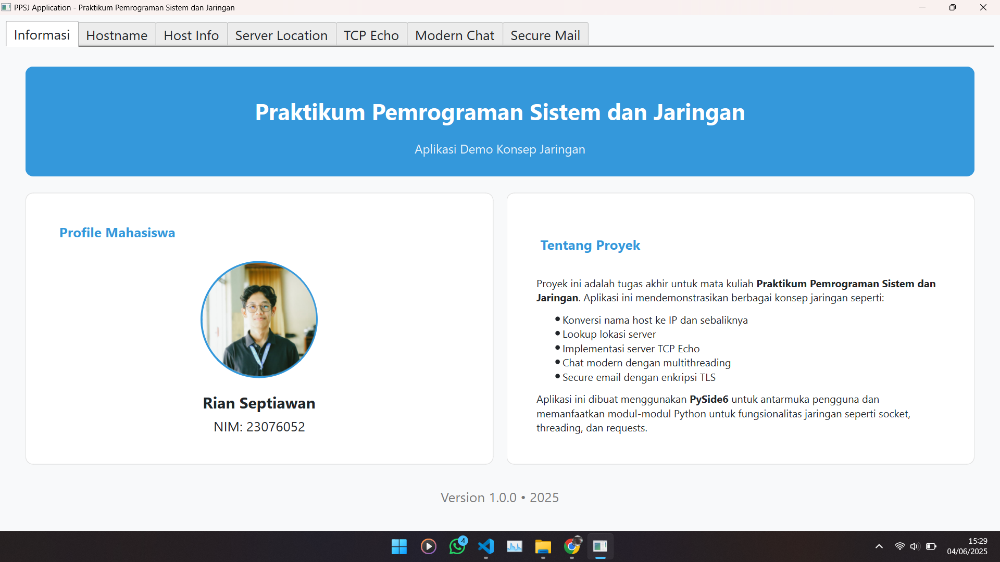

<div align="right">


</div>

# PPSJ Application - Praktikum Pemrograman Sistem dan Jaringan

## Overview



PPSJ Application is a comprehensive desktop application developed for the Network and System Programming Practicum course. This application demonstrates various network programming concepts through an interactive GUI interface built with PySide6 (Qt for Python). The application serves as both a learning tool and practical implementation of network protocols, client-server communication, and other networking fundamentals.

## Features

The application is organized into 7 modules, each accessible through a dedicated tab:

### 1. Information

- Displays application overview and project details
- Shows author information
- Presents project description and networking concepts covered

### 2. Hostname

- Retrieves and displays the local hostname and IP address
- Provides educational information about hostnames and their role in networking

### 3. Host Information

- **Name to IP**: Converts domain names to IP addresses with detailed WHOIS information
- **IP to Name**: Performs reverse DNS lookups to find hostnames from IP addresses
- Displays comprehensive domain information including registrar, creation date, and nameservers

### 4. Server Location

- Locates servers geographically using IP addresses
- Displays city, region, country, ISP, and coordinates of remote servers
- Uses external geolocation API services

### 5. TCP Echo

- Implements a complete TCP Echo server and client
- Features server controls for starting/stopping on configurable ports
- Real-time logging of client connections and message exchanges
- Support for broadcasting messages to all connected clients

### 6. Modern Chat

- Full-featured chat server and client implementation
- Multi-threaded server supporting multiple simultaneous client connections
- Dynamic creation of client tabs for multiple chat sessions
- Real-time message delivery with visual feedback

### 7. Secure Mail

- Send emails using the SMTP protocol with TLS encryption
- Supports custom SMTP server configuration
- Includes message composition with formatting options
- Provides status feedback and error handling

## Installation Requirements

1. Python 3.6 or later
2. PySide6 (Qt for Python)
3. Additional Python packages:
   - requests
   - socket
   - threading
   - smtplib
   - ssl
   - email

## Installation

1. Clone the repository:
   ```
   git clone https://github.com/yourusername/PPSJ_APP.git
   ```
2. Install dependencies:
   ```
   cd PPSJ_APP
   pip install PySide6 requests
   ```
3. Run the application:
   ```
   python main.py
   ```

## Usage

1. Launch the application by running `main.py`
2. Navigate through the tabs to access different network features
3. Each tab provides its own interface with clear instructions
4. Use the interactive elements to explore networking concepts

## Technology Stack

- **Frontend**: PySide6 (Qt for Python)
- **Backend**: Python 3.x
- **Networking**: Built-in Python modules (socket, threading, smtplib)
- **External APIs**: IP geolocation services
- **Design Pattern**: Tab-based modular architecture

## Development

This application demonstrates several advanced programming concepts:

- Multi-threaded network programming
- Event-driven GUI development
- Client-server architecture
- Network protocol implementation
- Secure communication using TLS/SSL


## License

This project is created for educational purposes as part of the Network and System Programming Practicum course. All rights reserved.

